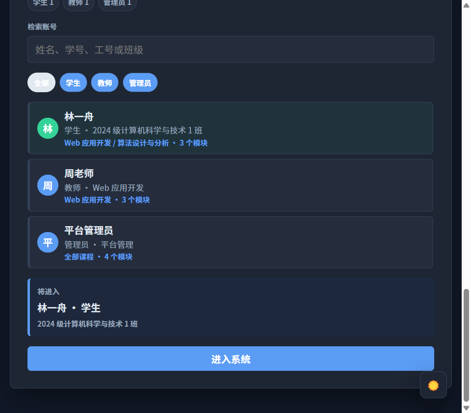
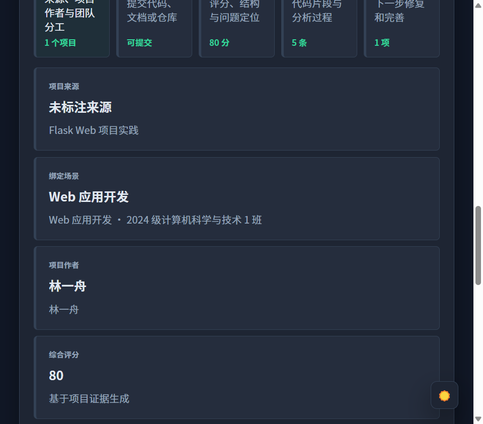
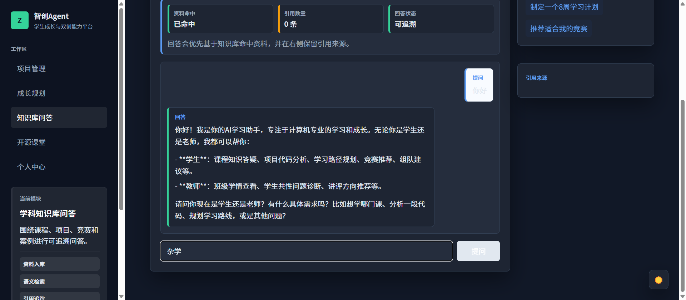
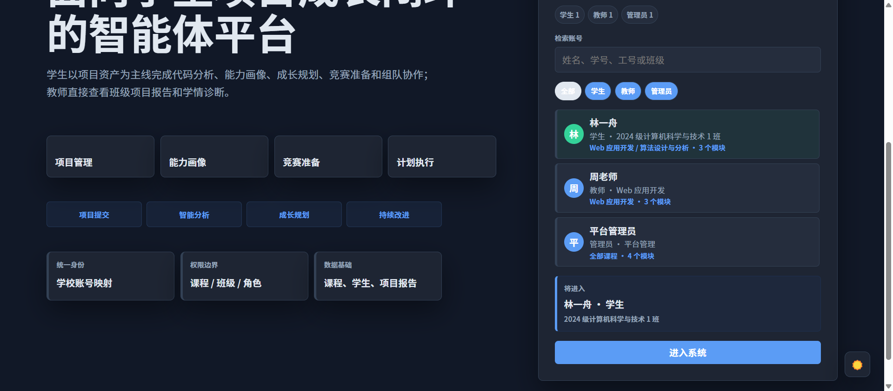

# 智创Agent · 计算机学科垂类大模型与双创能力赋能平台

> **GitLink × CCF 开源创新大赛 参赛作品**  
> 在线演示：http://70.39.193.15:5173

## 作品简介

智创Agent是一个面向计算机学科学生的**AI驱动成长与双创能力平台**，基于通用大模型+RAG知识库+LangGraph多Agent工作流架构，构建学科垂类智能体。系统集成了**项目管理与智能分析**、**能力画像与成长规划**、**知识库问答**、**竞赛推荐与组队协作**、**交互式开源课堂**等核心功能，服务真实教学场景。

## 功能演示

### 学生端 — 成长规划与能力画像


学生通过项目提交→智能分析→能力画像→成长规划→竞赛准备的闭环，完成从代码到能力的可视化成长。

### 教师端 — 项目分析与班级诊断


教师查看班级项目分析报告、学情诊断、梯队筛选和教学建议，数据驱动教学决策。

### 管理端 — 知识库问答


RAG检索增强生成，支持文档上传、语义搜索、引用追踪，知识库可持续积累。

### 项目管理 — 智能代码分析


代码提交→自动多维分析→评分报告(5维度)→问题定位→改进任务，完整闭环。

## 开源课堂 · 8门交互式课件

系统内置8门计算机课程共计96节交互式课件，每节课为独立HTML文件，支持键盘导航、自动播放、SVG可视化，可直接课堂投屏使用。

| 课程 | 章节 | 课节 | 核心内容 |
|------|:--:|:--:|------|
| 深度学习框架与编程 | 4章 | 12节 | 张量→计算图→自动求导→训练工程→实验报告 |
| AI基础设施 | 4章 | 12节 | GPU算子→内存访问→并行模型→编译器→分布式 |
| 编译原理 | 4章 | 12节 | 词法→语法→语义→IR→优化→AST |
| 计算机系统导论 | 4章 | 12节 | 机器表示→汇编→缓冲区→调用约定→异常 |
| 数据库系统概论 | 4章 | 12节 | ER建模→SQL→索引→事务→API设计 |
| 操作系统内核 | 4章 | 12节 | 启动→系统调用→进程→调度→内存→文件 |
| 计算思维 | 4章 | 12节 | 分解→抽象→状态机→递归→剪枝→调试 |
| 软件工程 | 4章 | 12节 | 需求→设计→编码→测试→部署→项目管理 |

## 技术架构

```
┌─────────────────────────────────────────────┐
│              前端 (React 18 + TS + Vite)      │
│   Ant Design + ECharts + Zustand             │
├─────────────────────────────────────────────┤
│              Nginx (Gzip + Cache + 安全头)     │
├─────────────────────────────────────────────┤
│          FastAPI 后端 + LangGraph Agent       │
│   SQLAlchemy + ChromaDB + PostgreSQL + Redis │
├─────────────────────────────────────────────┤
│       DeepSeek LLM + 通义千问 ASR + RAG       │
└─────────────────────────────────────────────┘
```

## 核心功能模块

| 模块 | 功能描述 | 适用角色 |
|------|---------|:--:|
| 项目管理 | 代码提交→多维分析→报告→改进任务闭环 | 学生/教师 |
| 成长规划 | 能力画像+学习计划+竞赛推荐+组队+执行追踪 | 学生 |
| 知识库问答 | RAG检索增强+文档上传+语义搜索+引用追踪 | 全部 |
| 开源课堂 | 8门课程96节交互式课件+课堂投屏 | 全部 |
| 教师看板 | 班级学情+项目报告+梯队筛选+教学建议 | 教师 |
| 个人中心 | 画像维护+学习目标+技能标签+项目经历 | 学生 |

## 快速开始

### 环境要求
- Python 3.11+ / Node.js 20+ / Docker & Docker Compose

### 本地开发
```bash
make dev          # 一键启动前后端
make test         # 运行测试
```

### Docker 部署
```bash
docker compose up --build -d
make smoke        # 检查服务健康
```

访问：前端 http://localhost:5173 | API http://localhost:8000/api

## 项目结构

```
├── backend/          # FastAPI后端 (API+LangGraph+RAG+Models)
├── frontend/         # React+Vite前端 (Pages+Theme+API)
│   └── public/open-course-lessons/  # 8门课程96节交互式课件
├── course-cases/     # 开源教学案例包
├── docs/             # 架构文档+API+SOP+部署说明
├── evals/            # RAG/Agent评测资产
├── infra/            # Docker部署配置
└── 立项/             # 需求文档+架构设计+立项PPT
```

## 部署优化

- ✅ Nginx Gzip压缩 (HTML/CSS/JS >60%体积缩减)
- ✅ 静态资源1年缓存 + ETag + immutable
- ✅ 安全响应头 (XSS/Frame/Content-Type)
- ✅ Docker容器健康检查 (自动恢复)
- ✅ 侧边栏亮/暗双主题
- ✅ 旧部署清理 (8容器→4容器)

## 演示账号

| 账号 | 角色 | 功能视图 |
|------|:--:|------|
| 林一舟 | 学生 | 成长规划+项目管理+知识库问答 |
| 周老师 | 教师 | 教师看板+项目管理+班级诊断 |
| 平台管理员 | 管理员 | 知识库管理+全部模块 |

## 许可证

本项目为 GitLink × CCF 开源创新大赛参赛作品，用于学术竞赛与教学展示。

---

<div align="center">
  <sub>Built with ❤️ for CS Education · GitLink × CCF 开源创新大赛</sub>
</div>
